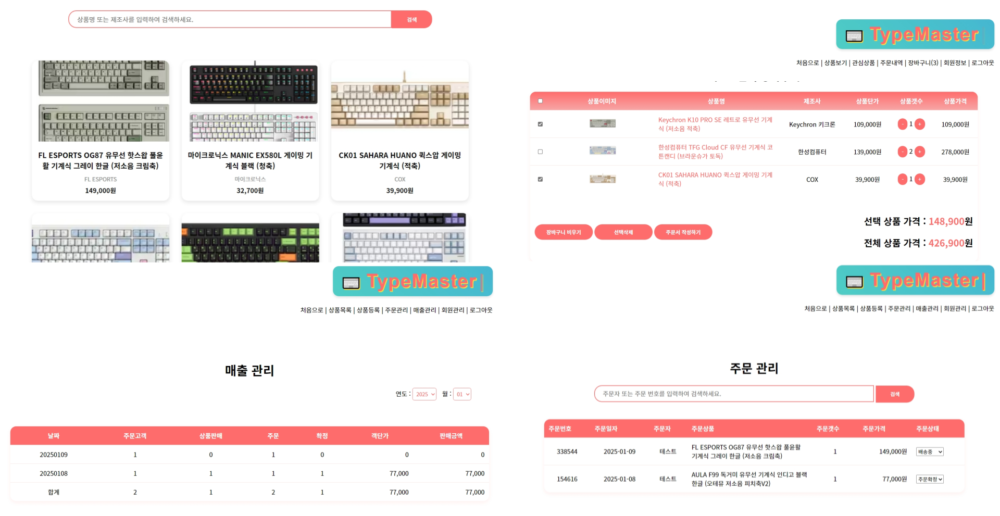

<h1>온라인 쇼핑몰</h1>

<h2>사용 기술</h2>

- Language: Java 17, JavaScript, HTML, CSS
- Framework : Spring Boot 4, Spring Security
- Library : MyBatis, Thymeleaf
- DB : Oracle 21c

<h2>주요 기능</h2>

- User: 관리자
  - 상품 정보 등록 및 수정
  - 주문 관리(현 주문 상태 조회, 상태 변경)
  - 매출 관리 (월별, 일별 매출 확인 가능)
  - 회원 관리
    
- User: 고객
  - 상품 조회 (상품 목록 및 상품 상세페이지)
  - 관심 상품 지정
  - 상품 장바구니 담기
  - 상품 주문
  - 주문 내역 관리 (배송 전 주문 취소 가능)
